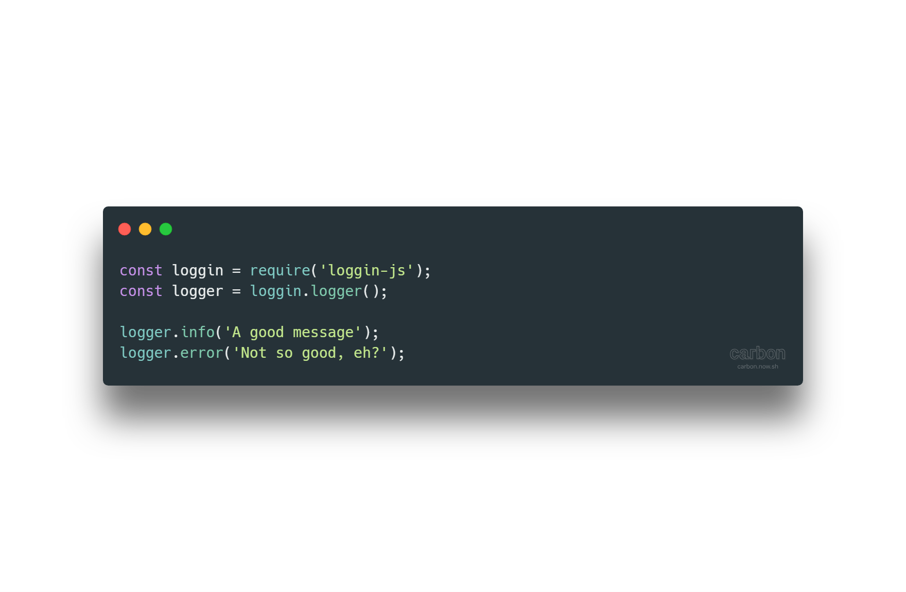

<!-- Links -->
[npm-image]: https://img.shields.io/npm/v/loggin-js-mongodb.svg?style=flat-square
[npm-url]: https://npmjs.org/package/loggin-js-mongodb

[travis-image]: https://img.shields.io/travis/nombrekeff/loggin-js-mongodb.svg?style=flat-square
[travis-url]: https://travis-ci.org/nombrekeff/loggin-js-mongodb

[code-quality-badge]: http://npm.packagequality.com/shield/loggin-js-mongodb.svg?style=flat-square
[code-quality-link]: https://packagequality.com/#?package=loggin-js-mongodb

[downloads-badge]: https://img.shields.io/npm/dm/loggin-js-mongodb.svg?style=flat-square
[downloads-link]: https://www.npmjs.com/package/loggin-js-mongodb

[dependencies-badge]: https://img.shields.io/david/nombrekeff/loggin-js-mongodb.svg?style=flat-square
[dependencies-link]: https://david-dm.org/nombrekeff/loggin-js-mongodb?view=tree

[vulnerabilities-badge]: https://snyk.io/test/npm/loggin-js-mongodb/badge.svg?style=flat-square
[vulnerabilities-link]: https://snyk.io/test/npm/loggin-js-mongodb

[docs:severity]: https://github.com/nombrekeff/loggin-js-mongodb/wiki/Severity
[docs:notifier]: https://github.com/nombrekeff/loggin-js-mongodb/wiki/Notifier
[docs:formatter]: https://github.com/nombrekeff/loggin-js-mongodb/wiki/Formatter
[docs:formatting]: https://github.com/nombrekeff/loggin-js-mongodb/wiki/Formatter
[docs:log]: https://github.com/nombrekeff/loggin-js-mongodb/wiki/Log
[docs:Logger]: https://github.com/nombrekeff/loggin-js-mongodb/wiki/Logger
[docs:channel]: https://github.com/nombrekeff/loggin-js-mongodb/wiki/Logger#channel
[docs:logger-options]: https://github.com/nombrekeff/loggin-js-mongodb/wiki/Logger#options
[docs:helper:logger]: https://github.com/nombrekeff/loggin-js-mongodb/wiki/Helper-.logger
[docs:helper:notifier]: https://github.com/nombrekeff/loggin-js-mongodb/wiki/Helper-.notifier
[docs:helper:formatter]: https://github.com/nombrekeff/loggin-js-mongodb/wiki/Helper-.formatter
[docs:helper:severity]: https://github.com/nombrekeff/loggin-js-mongodb/wiki/Helper-.severity
[docs:customizing]: https://github.com/nombrekeff/loggin-js-mongodb/wiki/logger#customizing
[docs:premades]: https://github.com/nombrekeff/loggin-js-mongodb/wiki/premades
[docs:plugins]: https://github.com/nombrekeff/loggin-js-mongodb/wiki/Plugins

<div align="center">

# Loggin'JS MongoDB Plugin  <!-- omit in toc -->

<!--  -->

[![NPM version][npm-image]][npm-url]
[![Downloads][downloads-badge]][downloads-link]
[![Dependencies][dependencies-badge]][dependencies-link]
[![Known Vulnerabilities][vulnerabilities-badge]][vulnerabilities-link]  
[![NPM quality][code-quality-badge]][code-quality-link]  
  
<p>
A little MongoDB plugin for loggin-js, save your logs centralized in a database. And later retrieval
</p>
</div>

****


## Table Of Content <!-- omit in toc -->
- [Features](#features)
- [Installing](#installing)
- [Importing](#importing)
- [Usage](#usage)
- [Collaborating](#collaborating)

## Features

## Installing
With npm
```bash
npm install loggin-js-mongodb
```

With yarn
```bash
yarn install loggin-js-mongodb
```

## Importing
Importing in node:
```js
const logginCentralizer = require('loggin-js-mongodb');
```

Importing using ES6 import:
```js
import logginCentralizer from 'loggin-js-mongodb';
```


## Usage
```js
const logginCentralizer = require('loggin-js-mongodb');
loggin.use(logginCentralizer);

let mongodb = loggin
    .notifier('mongodb', { dbUrl: 'mongodb://0.0.0.0:27017/logs' })
    .color(true)
    .level('debug')
    .formatter('detailed')
    .init();

let logger = loggin.logger();
logger.setNotifiers([csol, mongodb]);

...
let logs = mongodb.fetch({ 'level.name': 'ERROR' });

```

## Collaborating
Pull requests are welcome, as well as any other type of contribution. 

## Setting up <!-- omit in toc -->
```zsh
# clone the repo
$ git clone git@github.com:nombrekeff/loggin-js-mongodb.git

# enter the project
$ cd loggin-js-mongodb

# install dependencies
$ npm install

# run tests
$ npm test
```
